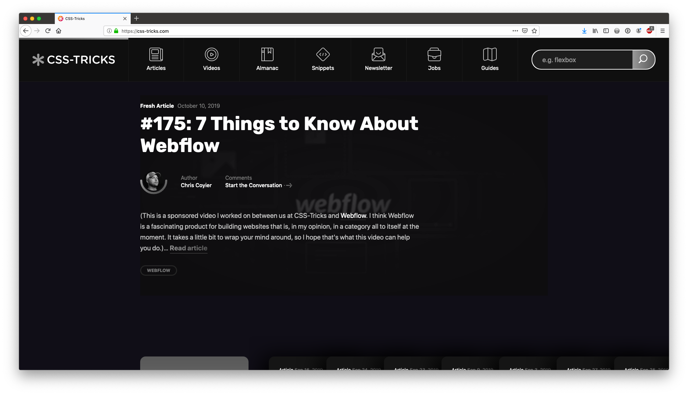
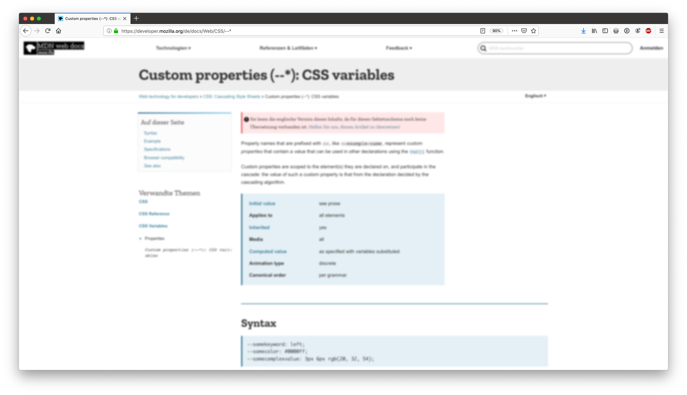
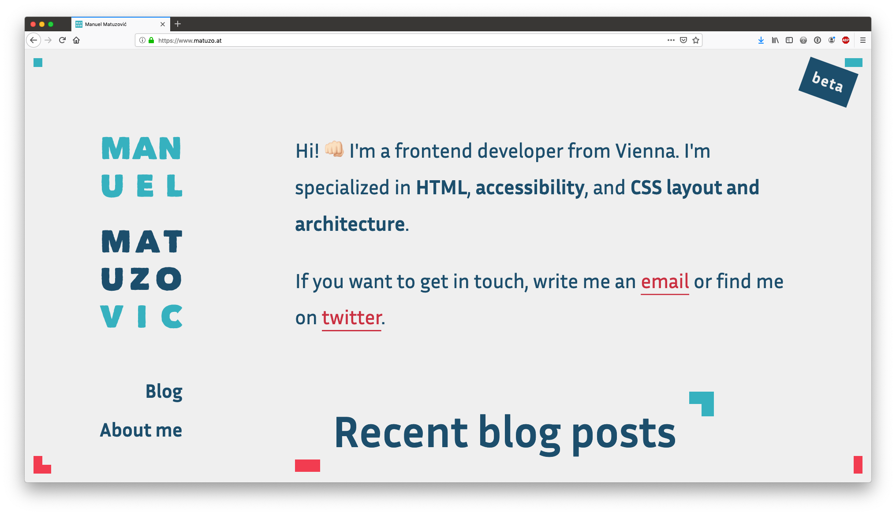

# a11y-tests.css

This CSS file is primarily intended for testing the accessibility of a page in different scenarios.
If you're looking for extensive debugging functionality, I'd recommend you check out [a11y.css](https://github.com/ffoodd/a11y.css).

[Demo](https://codepen.io/matuzo/debug/JjjYZxv)  
[CodePen](https://codepen.io/matuzo/pen/JjjYZxv)


## How it works

Add [a11y-tests.css](a11y-tests.css) to your site or copy (part of) the declarations and add them to your existing CSS.

You can test your page by adding a class or multiple classes to the `<html>` element.

## Tests

### No color `.a11y-tests-grayscale`

Test if you rely on color alone for conveying information.

```html
<html class="a11y-tests-grayscale">
    <head>…</head>
    <body>…</body>
</html>
```




### Blurred vision `.a11y-tests-blur`

Simulate blurred vision.

```html
<html class="a11y-tests-blur">
    …
</html>
```



### No mouse `.a11y-tests-no-mouse`

Force yourself to use your website without a mouse. This test sets `cursor: none` on all elements.

```html
<html class="a11y-tests-no-mouse">
    …
</html>
```

### Large text `.a11y-tests-large-text`

Increases the base font size. This test will only work if you're using `rem` in your `font-size` rules.

```html
<html class="a11y-tests-large-text">
    …
</html>
```



## Large text `.a11y-tests-no-animation`

Tests if your site works without transitions and animations.

```html
<html class="a11y-tests-no-animation">
    …
</html>
```
